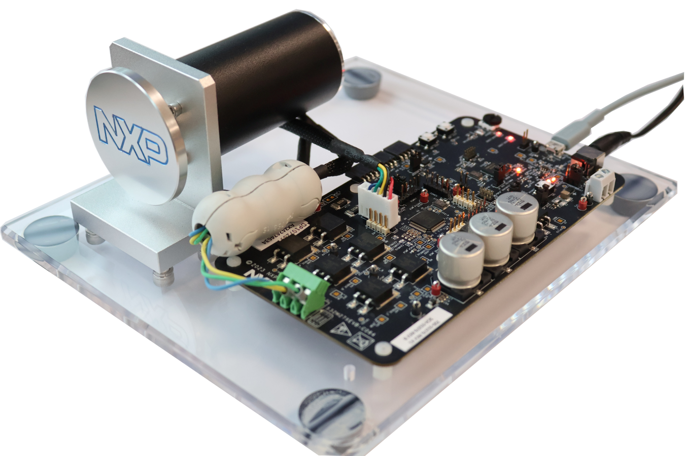
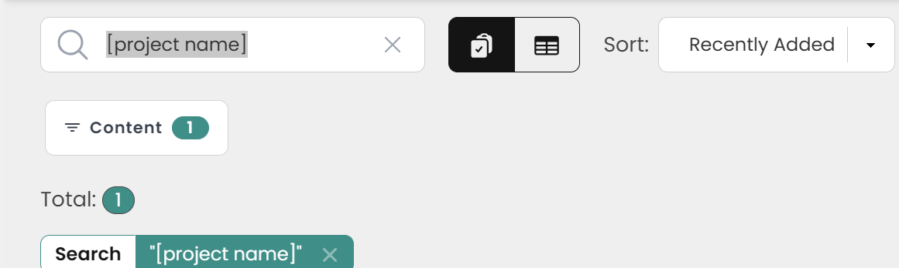
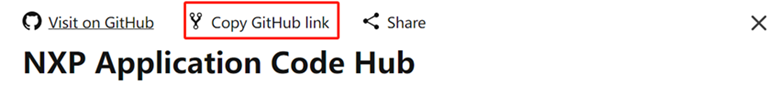
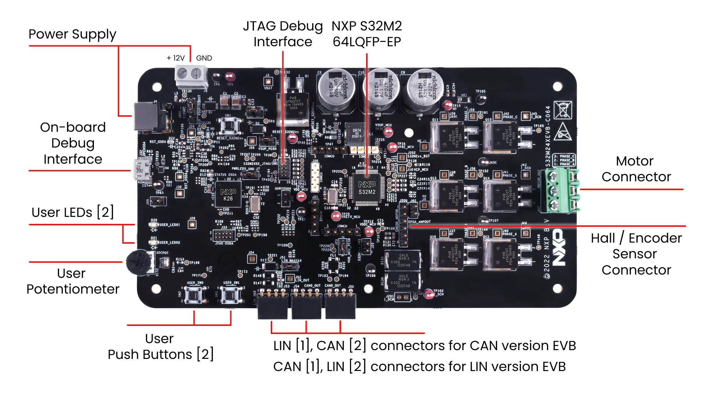
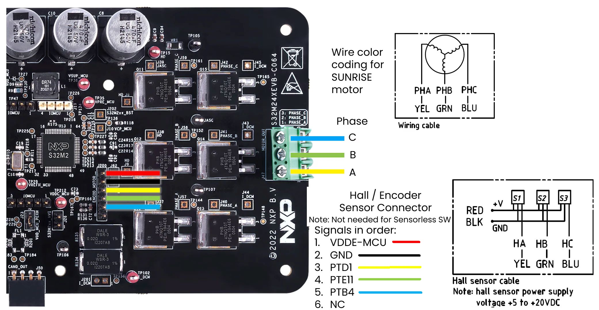
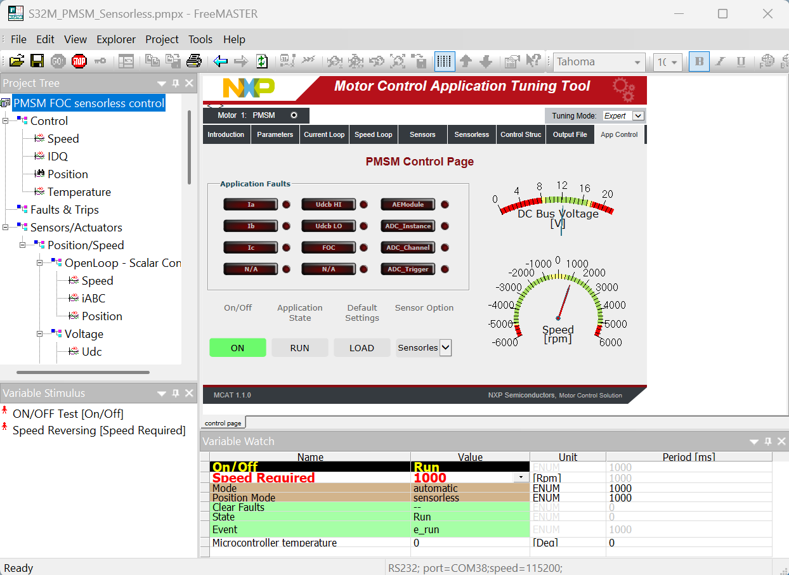
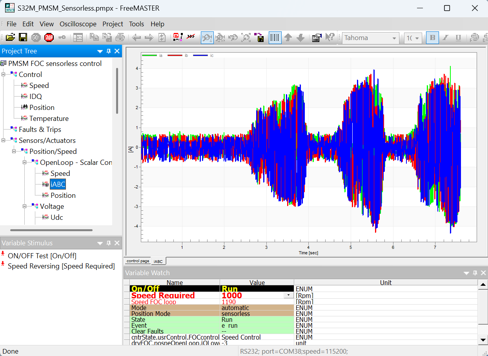
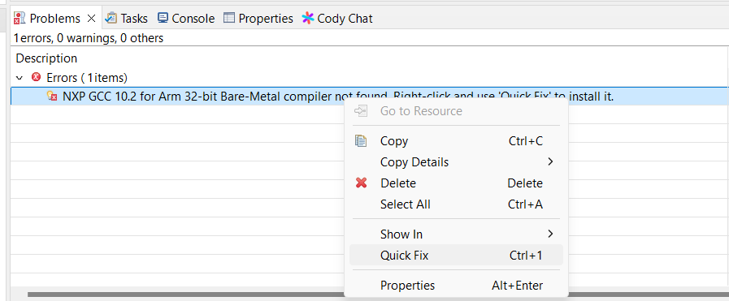
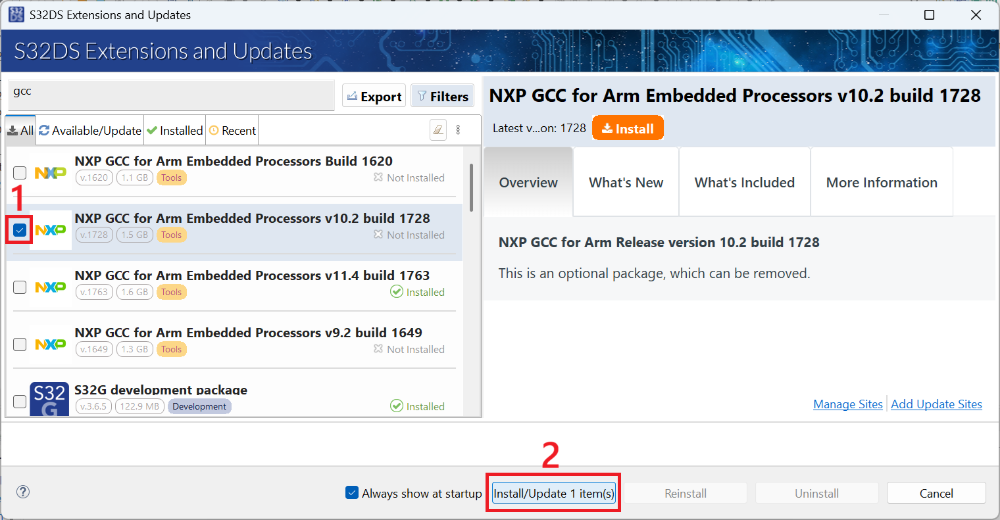
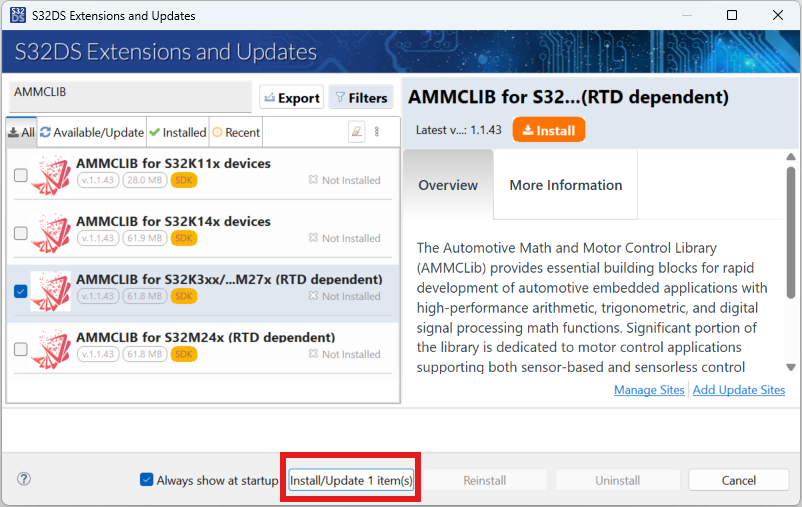

# NXP Application Code Hub
[](https://www.nxp.com)

## AN14482 3-Phase PMSM Field-Oriented Control Solution using FRDM-A-S32M276

This example demonstrates a sensorless Field Oriented Control (FOC) implementation for Permanent Magnet Synchronous Motor (PMSM) control using single shunt current sensing on the NXP S32M276 microcontroller.

The demo is based on the [AN14482 3-phase Sensorless PMSM Motor Control with S32M276](https://www.nxp.com/webapp/Download?colCode=AN14482), more details about the implementation can be found in the application note.
The complete setup with FRDM-A-S32M276 EVB, Sunrise motor is pictured below:
[<br>](./images/S32M27XEVB_MC.png)

#### Boards: FRDM-A-S32M276
#### Categories: Motor Control
#### Peripherals: BCTU, eMIOS, ADC, PWM, SPI, UART
#### Toolchains: S32 Design Studio IDE

## Table of Contents
1. [Software and Tools](#step1)
2. [Hardware](#step2)
3. [Setup](#step3)
4. [Results](#step4)
5. [FAQs](#step5)
6. [Support](#step6)
6. [Release Notes](#step7)

## 1. Software and Tools<a name="step1"></a>
This example was developed using the FRDM Automotive Bundle for S32K3. To download and install the complete software and tools ecosystem, use the following link:
- [S32K3 FRDM Automotive Board Installation Package](https://www.nxp.com/app-autopackagemgr/automotive-software-package-manager:AUTO-SW-PACKAGE-MANAGER?currentTab=0&selectedDevices=S32K3&applicationVersionID=156)
- [Automotive Math and Motor Control Library (AMMCLib) Rev 1.1.43](https://www.nxp.com/design/design-center/software/automotive-software-and-tools/automotive-math-and-motor-control-library-ammclib:AMMCLIB)
- [FreeMASTER Run-Time Debugging Tool](https://www.nxp.com/design/design-center/software/development-software/freemaster-run-time-debugging-tool:FREEMASTER)

## 2. Hardware<a name="step2"></a>
- Personal Computer
- 12V Power Supply
- micro-USB cable
- [FRDM-A-S32M276](https://www.nxp.com/design/design-center/development-boards-and-designs/S32M27XEVB)
[<br></p>](images/S32M27XEVB-LEFT.png)
- Sunrise Motor from [BLDC-KIT <br>](https://www.nxp.com/design/design-center/development-boards-and-designs/BLDC-KIT)

## 3. Setup<a name="step3"></a>
### 3.1 Import the project to S32 Design Studio IDE

1. Open S32 Design Studio IDE, in the Dashboard Panel, choose **Import project from Application Code Hub**.
   [<br></p>](./images/import_project_1.png)

2. Find the demo by searching the name directly.
    [<br></p>](./images/import_project_2.png)
    Open the project, click the **GitHub link**, S32 Design Studio IDE will automatically retrieve project attributes then click **Next>**.
    [<br></p>](./images/import_project_3.png)

3. Select **main** branch and then click **Next>**.

4. Select your local path for the repo in **Destination->Directory:** window. The S32 Design Studio IDE will clone the repo into this path, click **Next>**.

5. Select **Import existing Eclipse projects** then click **Next>**.

6. Select the project in this repo (only one project in this repo) then click **Finish**.

### 3.2 Generating, building and running the example application
1. In Project Explorer, right-click the project and select **Update Code and Build Project**. This will generate the configuration (Pins, Clocks, Peripherals), update the source code and build the project using the active configuration (e.g. Debug_FLASH).
Make sure the build completes successfully and the *.elf file is generated without errors.
[<br><br>](./images/update_and_build.png)
Press **Yes** in the **SDK Component Management** pop-up window to continue.

2. Go to Debug and select Debug Configurations. There will be a debug configuration for this project:

        Configuration Name                  Description
        -------------------------------     -----------------------
        $(example)_debug_flash_pemicro      Debug the FLASH configuration using PEmicro probe

    Select the desired debug configuration and click on **Debug**. Now the perspective will change to the **Debug Perspective**.
    Use the controls to control the program flow.

### 3.3 Connecting the Hardware

- Check the location of User Buttons, LEDs, 12 Vin DC power, micro-USB connector, Motor Phases, Hall connector JP1: [<br></p>](./images/S32M27XEVB-TOP.jpg)
- Connect 12V DC power supply to the board via the 12V power connector.
- Plug the micro-USB cable to the board for debugging and communication.
- Insert the motor phases (A,B,C) to the J47 Motor_Out on the board.
- Plug-in the Hall sensor connector to J200 on the board. See details in [3.3 Plug in the Encoder/HALL Sensors](https://www.nxp.com/document/guide/evaluation-board-setup-and-programming:GS-S32M27XEVB?section=plug-it-in_plug-it-in-3) [<br></p>](./images/S32M27XEVB_Hall.jpg)

### ⚠️ Safety Warnings
```
IMPORTANT - Read before starting the motor:
- Ensure motor is mechanically secured before testing
- Keep hands and loose clothing away from rotating parts
- Verify correct power supply voltage (12V DC, max current rating)
- Ensure proper ventilation - motors can overheat
- Use emergency stop procedures when testing
- Disconnect power before making hardware changes
- Never exceed motor's rated speed/current specifications
```

## 4. Results<a name="step4"></a>
1. Open FreeMASTER Run-Time Debugging Tool and establish a connection to the target board via micro-USB cable.
2. Open FreeMASTER_control/S32M_PMSM_Sensorless.pmpx project file in FreeMASTER.
3. Click on **"GO"** button to establish communication with the target board: [<br></p>](./images/FreeMASTER_Connect.png)
4. Go to App Control Tab and Press **"ON"** button to start the motor, set the Speed_Required value to desired motor speed (1000RPM):[<br></p>](./images/FreeMASTER_Running.png)
5. Observe the motor iABC current waveforms in real-time on the FreeMASTER: [<br></p>](./images/FreeMASTER_Waveforms.png)

## 5. FAQ<a name="step5"></a>
### Common Issues and Solutions
```markdown
Does FreeMASTER connect? 
├─ NO → Check USB cable, COM port, firmware loaded
└─ YES → Is "Fault" displayed?
    ├─ YES → Check fault code in FreeMASTER → Faults & Trips tab
    │   ├─ Overcurrent → Reduce current limit, check motor wiring
    │   ├─ Overvoltage/Undervoltage → Check 12V supply is within range
    │   ├─ Ia, Ib or Ic → See Motor Phases connection are correct
    │   └─ FOC → Verify motor shaft is free to rotate
    └─ NO → Check "ON" button pressed, Speed_Required > 0
```

- After loading the project, there is a message "NXP GCC 10.2 compiler not found":
  - Right-click on the project and select **Quick Fix** to install the required compiler: [<br></p>](./images/S32DS_Qfix.png)
  - Alternatively, navigate to **S32DS Extensions and Updates > NXP GCC 10.2 > Install** and add the NXP GCC 10.2 compiler: [<br></p>](./images/S32DS_GCC.png)
- After loading the project, there is a message "Path to collateral manifest does not exist ${S32K3xx_AMMCLIB}"
  - Install AMMCLIB from **S32DS Extensions and Updates > AMMCLIB for S32K3xx/S32M27x > Install** [<br></p>](./images/S32DS_AMMCLIB.png)

## 6. Support<a name="step6"></a>
* [AN14482 3-phase Sensorless PMSM Motor Control with S32M276](https://www.nxp.com/webapp/Download?colCode=AN14482)

#### Project Metadata

<!----- Boards ----->
[](https://www.nxp.com/design/design-center/development-boards-and-designs/S32M27XEVB)

<!----- Categories ----->
[](https://mcuxpresso.nxp.com/appcodehub?category=motor_control)

<!----- Peripherals ----->
[](https://mcuxpresso.nxp.com/appcodehub?peripheral=bctu)
[](https://mcuxpresso.nxp.com/appcodehub?peripheral=emios)
[](https://mcuxpresso.nxp.com/appcodehub?peripheral=adc)
[](https://mcuxpresso.nxp.com/appcodehub?peripheral=pwm)
[](https://mcuxpresso.nxp.com/appcodehub?peripheral=spi)
[](https://mcuxpresso.nxp.com/appcodehub?peripheral=uart)

<!----- Toolchains ----->
[](https://mcuxpresso.nxp.com/appcodehub?toolchain=s32_design_studio_ide)

Questions regarding the content/correctness of this example can be entered as Issues within this GitHub repository.

>**Warning**: For more general technical questions regarding NXP Microcontrollers and the difference in expected functionality, enter your questions on the [NXP Community Forum](https://community.nxp.com/)

[](https://www.youtube.com/NXP_Semiconductors)
[](https://www.linkedin.com/company/nxp-semiconductors)
[](https://www.facebook.com/nxpsemi/)
[](https://x.com/NXP)

## 7. Release Notes<a name="step7"></a>
| Version | Description / Update                           | Date                        |
|:-------:|------------------------------------------------|----------------------------:|
| 1.0     | Initial release on Application Code Hub        | February 27<sup>th</sup> 2026 |
